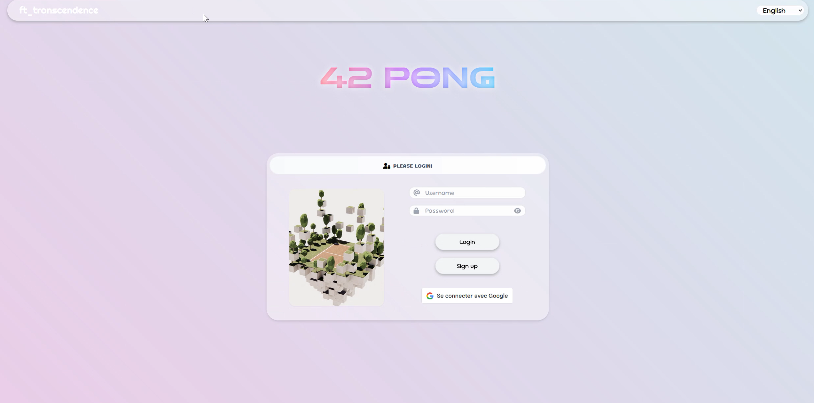
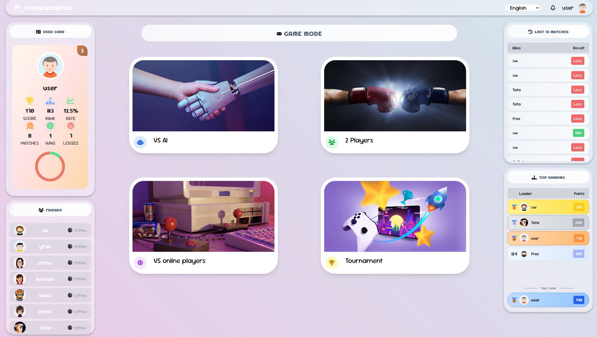
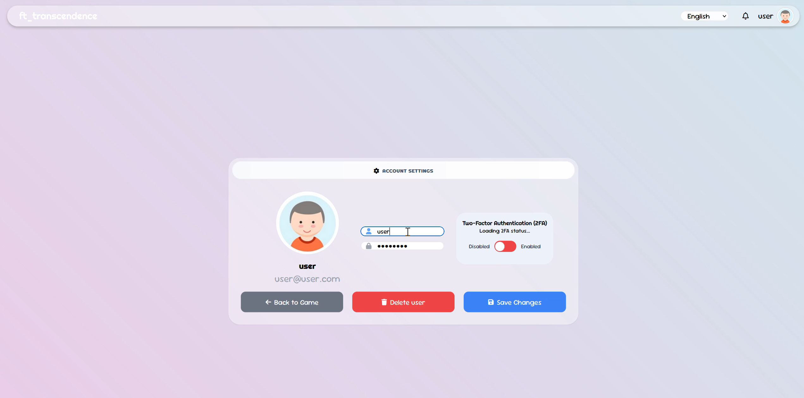
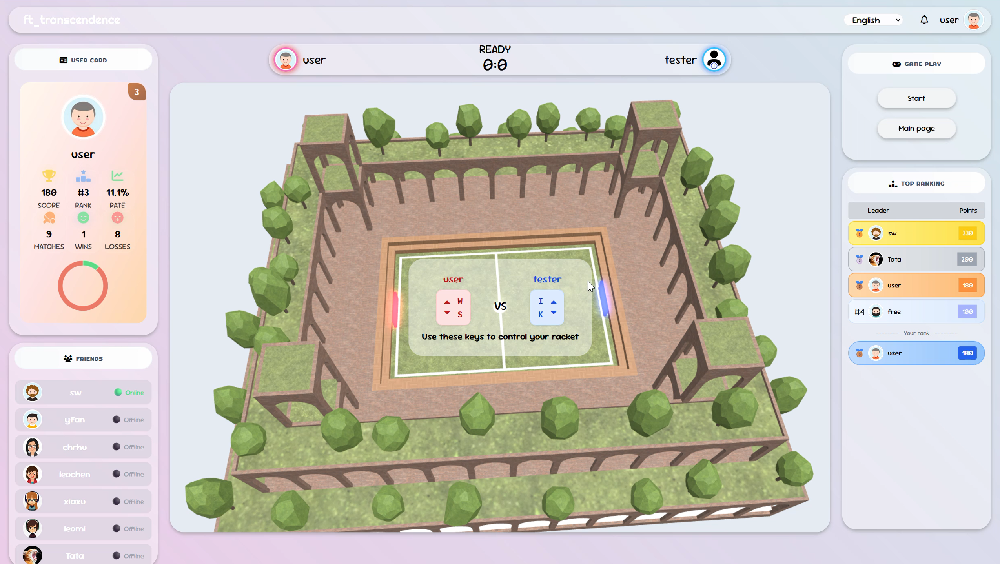
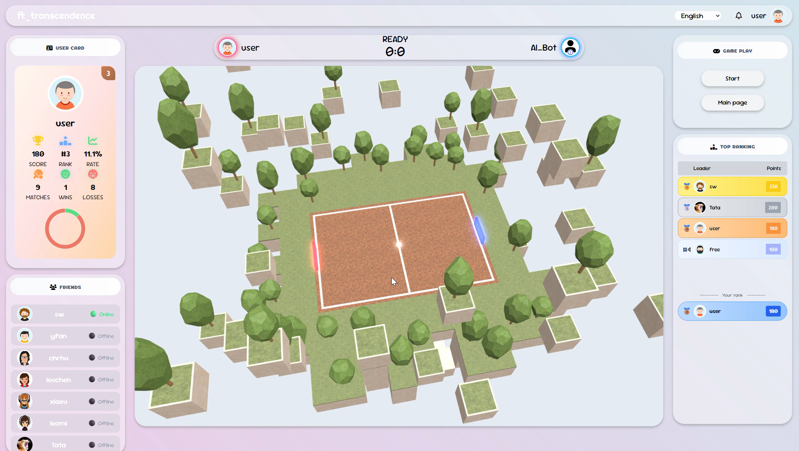
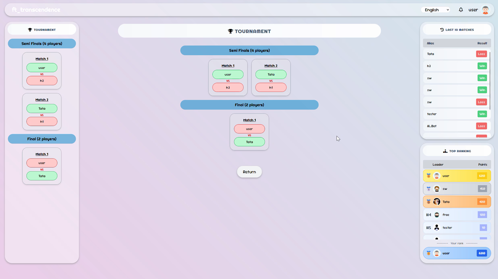
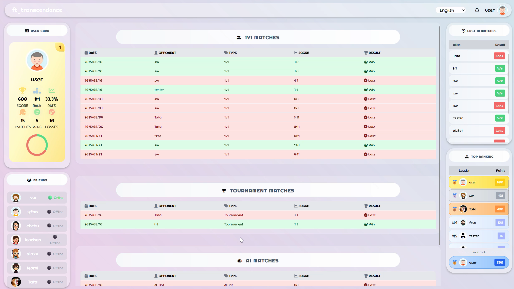
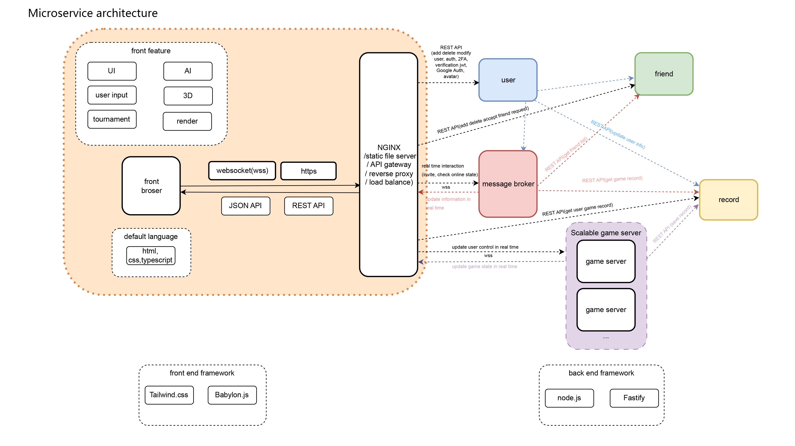

# 🎮 Transcendence – Real-Time Multiplayer Game Platform
A fullstack Pong-style online multiplayer web game, created by a team of 5.
built with a microservice architecture, WebSocket real-time communication, and secure authentication, featuring 3D rendering with Babylon.js.

[🎥 Watch on YouTube](https://www.youtube.com/watch?v=GUWTqCiNAI0)

## 🕹️Features:
Account management, enable/disable 2FA, JWT session management, Google sign in, upload avatar, prevent SQL injection / XSS attack
### Login page

### Main page

### User management

Local play vs AI, local play with 2 players, remote play, tournament, game records, ranking

### Stage1

### Stage2

### Tournament mode

### Game history

Add/remove friend, friend status, game dashboard
3D game stage, friendly and intuitive UI, real time update to enhance user experience

Handle unexpected disconnections.

## 🧰 Tech Stack
### Architecture

### Frontend
HTMl + Tailwind CSS + Typescript
Babylon.js – Browser-based 3D game rendering
WebSocket (wss) – Real-time multiplayer communication
Custom Game AI for offline or practice mode

### Backend
Node.js + Fastify
Microservices: Client, User management, Scalable Game Engine, Message broker,  Friend, Record
SQLite (better-sqlite3)
OAuth2 (Google) + 2FA (QR code) for secure login
REST APIs + WebSocket server for gameplay
Game session and concurrency management
Infrastructure & DevOps
NGINX – API gateway, Reverse proxy, SSL termination, static assets, load balance
Docker & Docker Compose – Containerized deployment

## 🔐 Authentication & Security
OAuth2 login via Google
2-Factor Authentication
Session management with JWT

## 📦 build & Usage
### Prerequisites
Docker & Docker Compose & Makefile
Google OAuth2 credentials & 2FA application

### build
First put .env in the root with mandatory enviromental variable GOOGLE_USER_ID and JWT_SECRET
optional TEST_ACCOUNTS if you want to add them. eg: TEST_ACCOUNTS='[{"username":"user@user.com", "password":"Testuser123@", "alias":"user"}]'

Then build & Run with Make
make
The make command will build all backend and frontend components and create Docker images then run.

retrive data: make get-data
put preset data before build: make put-data

### Access
Open your browser and go to https://localhost:9000(local) https://serverip:9000(remote)

Recommended browser: Firefox for best compatibility and performance.
